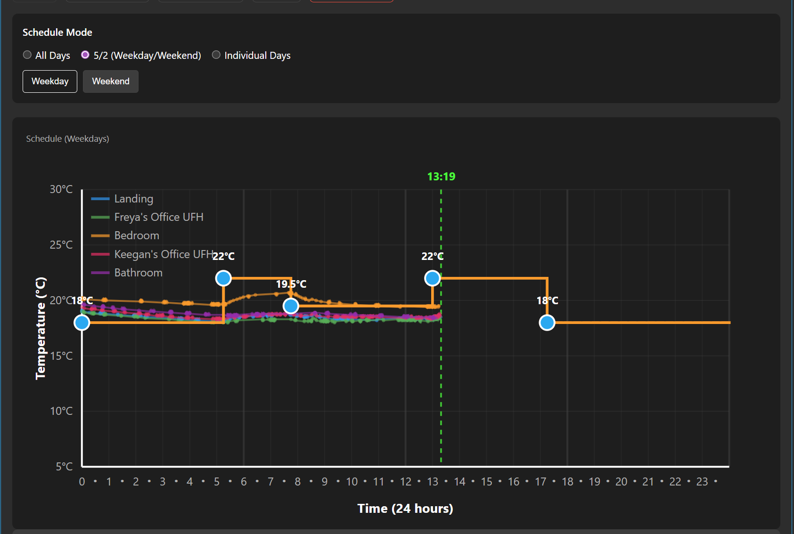
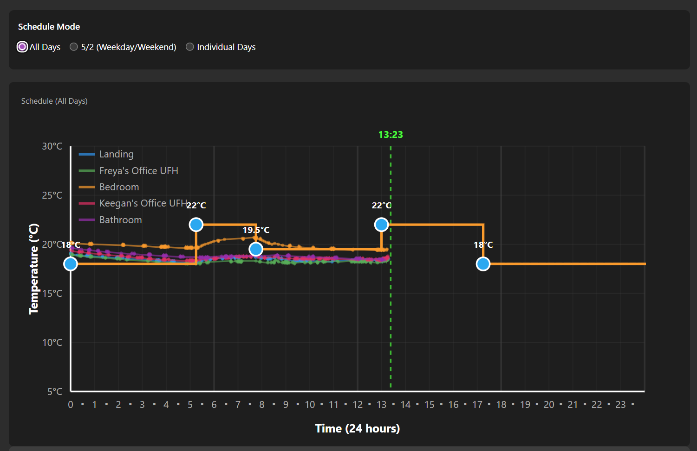
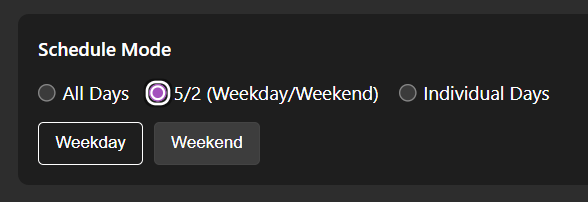
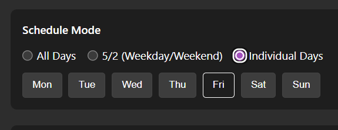
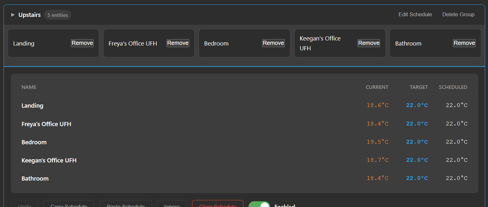
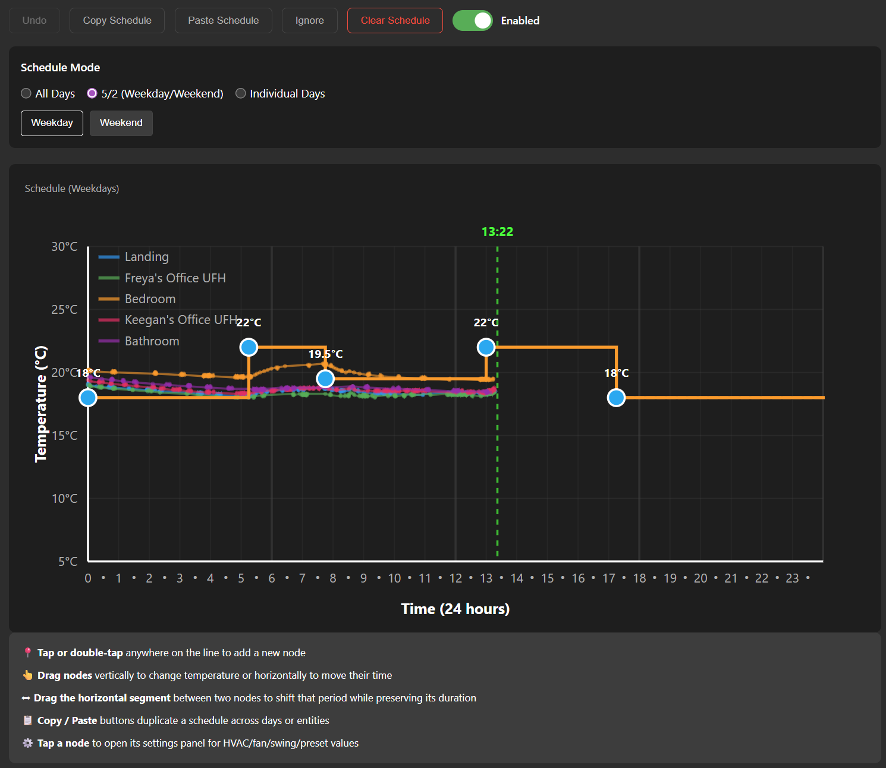

# Climate Scheduler for Home Assistant


A custom Home Assistant integration that provides intelligent 24-hour, weekday/weekend, and 7-day scheduling for climate entities (thermostats, HVAC systems, and heaters) with an intuitive touch-friendly graph interface.





## Features

- 📱 **User Friendly Interface** - Touch-friendly graph editor works seamlessly on tablets and desktop browsers. 
- ⏰ **15-Minute Precision** - Schedule temperature changes at 15-minute intervals throughout the day
- 📊 **Visual Graph Editor** - Interactive SVG graph with draggable nodes, segment dragging, and copy/paste controls for fast schedule reuse
- 📈 **Temperature History Overlay** - Actual room temperature for the current day is drawn as a secondary line so you can compare target vs. measured
- 🏠 **Multi-Entity & Group Support** - Manage and sync schedules for individual climate entities and pre-defined groups
- 🔄 **Immediate Apply** - Saving a schedule forces the coordinator to rerun so the active period changes without waiting for the next cycle
- 💾 **Persistent Storage** - Schedules are stored in `.storage/climate_scheduler_data` and survive Home Assistant restarts
- ⚙️ **Advanced Climate Controls** - Set HVAC mode, fan mode, swing mode, preset, and enabled state per schedule node
- 🌡️ **Unit Awareness** - Automatically uses your Home Assistant temperature unit (°C or °F)
- 🎯 **Fine-Grained Control** - Toggle schedules on/off without losing configuration and clear them when you want a fresh start
- 🧩 **UI-Based Setup (Config Flow)** - Add via Settings → Devices & Services → Add Integration; YAML is optional and auto-imported if present

## Known Issues
- Editing the graph on the mobile app doesn't seem to work, as a workaround you can tap on a node and edit using the UI below the graph.
- Sometimes auto-save doesn't function consistently, you may need to refresh the page to see the new values in the graph or to try updating the schedule again.

## Usage

### Adding to a Dashboard

**Recommended Method (UI):**

1. Go to any dashboard
2. Click "Edit Dashboard" (three dots → Edit Dashboard)
3. Click "Add Card"
4. Search for "Climate Scheduler" or use "Custom: Climate Scheduler Card"
5. Click to add it
6. Optionally set the view to "Panel" mode for a full-page experience

**Quick Setup**: For a dedicated dashboard, create a new dashboard and add the Climate Scheduler card with panel mode enabled for the best experience.

**Alternative (YAML):**

Add the card manually with YAML (Manual card):

```yaml
type: custom:climate-scheduler-card
```

For panel mode in a view:
```yaml
views:
  - title: Scheduler
    panel: true
    cards:
      - type: custom:climate-scheduler-card
```

**Troubleshooting:**
- The card resource is automatically registered when installed via HACS
- If you see "Custom element doesn't exist", reload the integration and hard-refresh your browser (Shift+Reload)
- For YAML mode dashboards, you may need to manually add the resource:
  ```yaml
  resources:
    - url: /api/climate_scheduler/card.js
      type: module
  ```

### Using the Scheduler

1. Check the climate entities you want to schedule (they move to "Active")
2. Click on an entity or group to open the inline schedule editor
3. **Tap or double-tap** lines on the graph to add nodes at desired times
4. **Drag nodes** horizontally/vertically for time and temperature adjustments
5. **Drag the horizontal segment** between two nodes to slide that entire heating/cooling period while keeping the duration fixed
6. Use the **Copy** button to copy the currently visible day's pattern, then **Paste** it onto another day or entity
7. **Tap a node** to open its settings panel for HVAC/fan/swing/preset options
8. Changes auto-save and immediately trigger the coordinator so active periods update right away
9. Use the **three-dot menu** to refresh entities, enable/disable schedules, or sync groups
10. Toggle **Enabled** to activate/deactivate a schedule without losing configuration
11. Use **Clear Schedule** to remove a schedule entirely (confirmation required)

## Screenshots


_Daily scheduler (all days) with draggable nodes and segments._


_5/2 mode editor showing separate Weekday and Weekend schedules._


_Seven-day individual schedules with per-day editing._


_Grouped entities for managing multiple thermostats together._


_Schedule editor with copy/paste controls and segment dragging._


## Installation

This integration supports UI-based setup (config entry). No YAML is required.

### HACS (Recommended)

1. Open HACS in Home Assistant
2. Click on "Integrations"
3. Click the three dots in the top right corner
4. Select "Custom repositories"
5. Enter the repository URL: `https://github.com/kneave/climate-scheduler`
6. Select category: "Integration"
7. Click "Add"
8. Search for "Climate Scheduler" and install
9. Go to Settings → Devices & Services → Add Integration → search for "Climate Scheduler" and add it (if it doesn't appear, restart Home Assistant and try again)

### Manual Installation

1. Download the latest release from [GitHub](https://github.com/kneave/climate-scheduler/releases)
2. Copy the `custom_components/climate_scheduler` folder to your `config/custom_components/` directory
3. Restart Home Assistant
4. Go to Settings → Devices & Services → Add Integration → search for "Climate Scheduler" and add it
	- Optional (legacy): Add `climate_scheduler:` to your `configuration.yaml`; it will be auto-imported into a config entry
5. Restart Home Assistant again (only if you used YAML)


## Default Schedule

When you first enable a climate entity, it starts with a simple default:
- **00:00** - 18°C (constant temperature)

You can customize this by:
- Tapping the graph to add nodes at different times
- Dragging nodes to change time or temperature
- Tapping nodes to set HVAC/fan/swing/preset modes
- Removing nodes by tapping them and clicking "Delete Node"

## Graph Features

- **Blue line**: Actual room temperature history for the current day
- **Orange line**: Your scheduled target temperature
- **Green dashed line**: Current time indicator
- **Circles**: Schedule nodes (tap to edit, drag to move)
- **Horizontal segments**: Drag the line between two nodes to shift that time block without changing its duration
- **Copy/Paste controls**: Copy a day's configuration and paste it onto another day or thermostat for instant duplication

## Requirements

- Home Assistant Core 2024.1.0 or later
- At least one climate entity configured in Home Assistant

## Support

For issues, feature requests, or questions:
- [GitHub Issues](https://github.com/kneave/climate-scheduler/issues)
- [Discussions](https://github.com/kneave/climate-scheduler/discussions)

## License

MIT License - see [LICENSE](LICENSE) file for details

## Development & AI Attribution

This project was developed with the assistance of AI language models, specifically Claude (Anthropic) through the GitHub Copilot Chat interface in Visual Studio Code. The AI assisted with:

- Architecture design and implementation
- Code generation for both backend (Python) and frontend (JavaScript/HTML/CSS)
- Integration with Home Assistant APIs and WebSocket communication
- SVG graph interaction and touch-friendly interface design
- Documentation and development workflows

### Key References & Resources

The following resources were consulted during development:

**Home Assistant Development:**
- [Home Assistant Developer Documentation](https://developers.home-assistant.io/)
- [Home Assistant Architecture](https://developers.home-assistant.io/docs/architecture_index)
- [Creating a Custom Integration](https://developers.home-assistant.io/docs/creating_integration_manifest)
- [Frontend Development](https://developers.home-assistant.io/docs/frontend/)

**Home Assistant APIs:**
- [WebSocket API](https://developers.home-assistant.io/docs/api/websocket)
- [REST API](https://developers.home-assistant.io/docs/api/rest)
- [Climate Entity Documentation](https://www.home-assistant.io/integrations/climate/)
- [DataUpdateCoordinator](https://developers.home-assistant.io/docs/integration_fetching_data)

**Web Technologies:**
- [MDN Web Docs - SVG](https://developer.mozilla.org/en-US/docs/Web/SVG)
- [MDN Web Docs - Touch Events](https://developer.mozilla.org/en-US/docs/Web/API/Touch_events)
- [MDN Web Docs - Pointer Events](https://developer.mozilla.org/en-US/docs/Web/API/Pointer_events)

**Python Libraries:**
- Home Assistant Core framework and utilities
- aiohttp for async HTTP operations
- JSON storage via Home Assistant Store

### Disclaimer

While AI models provided significant assistance in code generation and problem-solving, this project is provided "as-is" without warranty of any kind. The code has been developed and tested on a best-effort basis. Users should review the code and test thoroughly in their own environments before relying on it for critical heating/cooling control. Use at your own risk.


